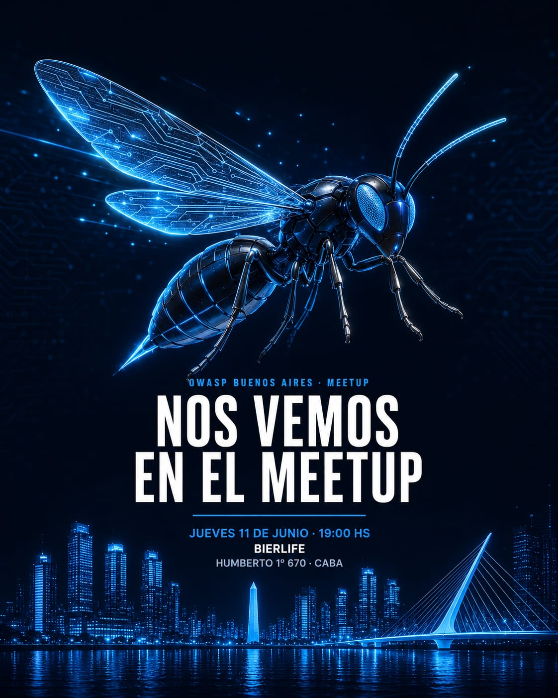

# Eventos

## 2026

## Próximos eventos // Upcoming Meeting

### Tercer Evento 2026 de Owasp Buenos Aires (25/08)

​Después del relanzamiento y del Hack & Beer, seguimos: llega el 3er Meetup de OWASP Buenos Aires. Un encuentro de charlas cortas, seguridad aplicada y mucha comunidad, en un espacio nuevo y con más lugar del que teníamos.
​Hablaremos de seguridad en aplicaciones, de proyectos OWASP y de lo que se está rompiendo (y arreglando) hoy en la industria. Si trabajás en tecnología, estudiás, o simplemente te pica la curiosidad, este es tu lugar. No hace falta ser experto: acá se viene a aprender.
​Llegá temprano para ligar stickers y un lugar cómodo. 🎟️

- Martes 25 de agosto 2026 - Tercer Encuentro 2026 Owasp Buenos Aires
- Lugar y Hora: Hormiga Negra - Almagro - 🕡 18:30 Hs.
- Agenda:
- 18:30 hs — Apertura.
- 18:45 hs — Primer Charla.
- 21:30 hs — Cierre y próximos pasos de la comunidad.
- Anotate [acá](https://luma.com/qe4ua87c).

<!-- 
### Muy Pronto!!!  
-->

## Eventos Pasados // Past Events

### Hack&Beer 2026 Owasp Buenos Aires (05/07)

- 05 de Julio 2026 - Hack & Beer: OWASP Juice ShopOwasp Buenos Aires
  
- Lugar y Hora: MAUER - Bar - 🕡 18:00 Hs.
- Tuvimos un espacio relajado para aprender haciendo. Exploramos OWASP Juice Shop, una web app repleta de vulnerabilidades reales para descubrir, entender y explotar, con algo de guía del equipo pero a base de prueba, error, y mucha curiosidad.
​- Pura comunidad y seguridad accesible para todos los niveles.
- Llevamos nuestras notebooks, con OWASP ZAP o Burp Suite instalado y configurado. 💻

  ## Presentaciones
  Breve Introducción [aquí](https://drive.google.com/file/d/1pdPDmH5viuAVPhe6S1oSrQ3Lvr0Tolk2/view?usp=sharing).

<!-- 

​
- Agenda:
- 18:00 hs — Apertura y setup. Conectá tu compu, acomodate, y disfrutá de un traguito.
- 18:30 hs — Intro rápida al formato y a OWASP Juice Shop.
- 18:45 hs — ¡A hackear! Exploración guiada de Juice Shop + lockpicking, gadgets y networking.
- 22:00 hs — Cierre y próximos pasos de la comunidad.
- Anotate [acá](https://luma.com/112m0b9j).
-->

### Primer Evento 2026 de Owasp Buenos Aires (11/06)

- 11 de Junio 2026 - Primer Encuentro 2026 Owasp Buenos Aires
- Lugar y Hora: Bierlife - 🕡 18:30 Hs.
  
## Presentaciones

- Introducción a OWASP, por W. Martín Villalba (OWASP BA & SB).
- Introducción al proyecto OWASP GenAI, por Martín Rojas (OWASP BA) [aquí](https://drive.google.com/file/d/1O2v5IRPIUOqpjTe_ychHfqa9KiEj92Ln/view?usp=drive_link).
- Anatomía de una intrusión de ransomware real, por Emanuel D’Amico (OWASP BA).
- Próximamente subimos más info de las charlas .

<!-- 
### End  
-->

